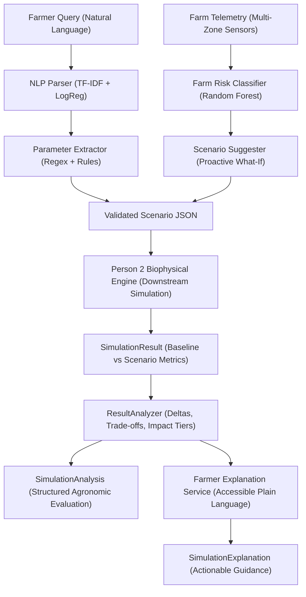

# AI Agriculture Simulator — AI & Scenario Intelligence (Person 3 Module)

A modular, standalone intelligence service for the AI Agriculture Simulator. This module serves as the agronomic reasoning, risk analysis, and scenario generation engine that interacts between the farmer (natural language), the central backend, and Person 2's biophysical simulation engine.

---

## 🌾 Module Responsibilities

1. **Natural Language Scenario Parsing**: Understand farmer conversational requests (e.g., *"What if rainfall decreases by 30% for 45 days in zone 2?"*) and transform them into structured, validated scenario contracts.
2. **Scenario Schema Validation**: Ensure perturbations (temperature deltas, precipitation cuts, irrigation failures, nutrient stress, pest/disease pressure) adhere to strict physical boundaries before sending them to the simulation engine.
3. **Farm Risk Analysis**: Evaluate multi-zone telemetry (soil moisture, growth stage, ambient conditions, N-P-K nutrient levels) to identify imminent agronomic vulnerabilities.
4. **Intelligent "What-If" Suggestions**: Proactively formulate counter-factual scenarios and stress-tests tailored to current crop vulnerabilities.
5. **Farmer-Friendly Explanations**: Translate biophysical simulation outcomes (yield loss, water stress index, root-zone depletion) into clear, actionable advice.

---

## 🔄 Scenario Understanding Pipeline (Phase 1 & 2)

```
Farmer Natural Language Inquiry
          ↓
  Text Normalization (contractions, %, °C, word numbers)
          ↓
  Scenario Intent Classification (TF-IDF + Logistic Regression)
          ↓
  Entity & Parameter Extraction (Regex & Multi-Shock Extractor)
          ↓
  Pydantic Validation (Scenario, ScenarioChanges, Zone)
          ↓
  Validated Scenario JSON / Clarification Request
```

> [!IMPORTANT]
> **Scope Distinction**: This module extracts intent and numerical parameters for scenario perturbation. It does **NOT** simulate plant growth, evapotranspiration, or final grain yield, which is calculated downstream by Person 2's biophysical simulation engine.

---

## 🤖 Machine Learning Model: Scenario Intent Classifier

- **Architecture**: `TfidfVectorizer` (sublinear term frequency, unigram & bigram features `ngram_range=(1, 2)`) + `LogisticRegression` (multinomial, balanced class weights, $C=8.0$, L-BFGS solver).
- **Inference**: Local, deterministic, sub-millisecond execution on CPU without GPU or cloud LLM dependencies.
- **Model Artifact**: [`app/models/scenario_classifier.joblib`](file:///c:/Users/maste/Documents/antigravity/quick-newton/app/models/scenario_classifier.joblib).
- **Training Dataset**: [`data/scenario_training.csv`](file:///c:/Users/maste/Documents/antigravity/quick-newton/data/scenario_training.csv) (803 curated agricultural expressions across 13 classes).
- **Metrics Report**: [`data/scenario_classifier_metrics.json`](file:///c:/Users/maste/Documents/antigravity/quick-newton/data/scenario_classifier_metrics.json).

### Supported Scenario Types (13 Classes)
`RAIN_REDUCTION`, `RAIN_INCREASE`, `TEMPERATURE_INCREASE`, `HEATWAVE`, `IRRIGATION_INCREASE`, `IRRIGATION_DECREASE`, `IRRIGATION_FAILURE`, `FERTILIZER_CHANGE`, `NUTRIENT_DEFICIENCY`, `DISEASE_OUTBREAK`, `PEST_OUTBREAK`, `SOIL_MOISTURE_CHANGE`, `COMBINED`.

---

## 🔍 Entity & Parameter Extraction (Phase 2)

The extraction engine ([`app/services/scenario_extractor.py`](file:///c:/Users/maste/Documents/antigravity/quick-newton/app/services/scenario_extractor.py)) deterministically parses numerical and operational parameters from farmer text.

### Supported Entities & Conventions

| Entity | Supported Phrasing | Extracted Field | Output Convention / Formula |
|---|---|---|---|
| **Rain Reduction** | `reduce rainfall by 30%`, `30% less rain`, `half the rainfall` | `rainfall_multiplier` | $1.0 - (\text{percentage} / 100) \rightarrow 0.70$, half $\rightarrow 0.50$ |
| **Rain Increase** | `increase rainfall by 40%`, `40% more rain`, `double rainfall` | `rainfall_multiplier` | $1.0 + (\text{percentage} / 100) \rightarrow 1.40$, double $\rightarrow 2.00$ |
| **Temperature** | `temperature increases by 3°C`, `weather gets 3 degrees hotter`, `+3°C` | `temperature_delta` | $+3.0$ (positive Celsius delta) |
| **Temperature Drop** | `temperature drops by 4 degrees`, `4°C cooling`, `-4°C` | `temperature_delta` | $-4.0$ (negative Celsius delta) |
| **Irrigation Increase**| `increase irrigation by 20%`, `20% more watering`, `double irrigation` | `irrigation_multiplier`| $1.0 + (\text{percentage} / 100) \rightarrow 1.20$, double $\rightarrow 2.00$ |
| **Irrigation Decrease**| `reduce irrigation by 30%`, `cut watering by half` | `irrigation_multiplier`| $1.0 - (\text{percentage} / 100) \rightarrow 0.70$, half $\rightarrow 0.50$ |
| **Irrigation Failure** | `pump breaks down`, `tube well failure`, `water stops` | `irrigation_multiplier`| $0.0$ (total cutoff) |
| **Fertilizer Change**  | `reduce fertilizer by 25%`, `increase NPK by 15%` | `fertilizer_multiplier`| Reduction $\rightarrow 0.75$, Increase $\rightarrow 1.15$ |
| **Duration** | `for 45 days`, `for 2 weeks`, `for one month`, `next 7 days` | `duration_days` | Explicit days: $45$, $2\text{ weeks} \rightarrow 14$, $1\text{ month} \rightarrow 30$ |
| **Target Zones** | `in zone 2`, `zones 1 and 3`, `North Field`, `all zones` | `target_zones` | `["zone-2"]`, `["zone-1", "zone-3"]`, `["north-field"]`, all zones $\rightarrow []$ |
| **Disease / Pest** | `disease outbreak`, `pests attack zone 1`, `50% infection` | `disease_pressure`, `pest_pressure` | Baseline index: $1.0$ (or scaled decimal $0.50$) |
| **Combined Shocks** | Multiple simultaneous clauses | Multiple fields | Extracted independently without dropping fields |

### Unsupported Expressions (Documented Boundaries)
To ensure reliable operation without silent misinterpretation, the following complex expressions are currently unsupported and will prompt for clarification:
- **Relative Calendar Boundaries**: Phrases like *"until next harvest"*, *"until next Tuesday"*, or *"until end of monsoon season"*.
- **Vague Qualitative Quantifiers**: Words like *"a little bit more water"*, *"slight warming"*, or *"some extra fertilizer"*.
- **Multi-Hop Calculations**: Phrases like *"twice as much water as two weeks ago"*.

---

## 📁 Project Structure

```
quick-newton/
│
├── app/
│   ├── __init__.py               # Package metadata
│   ├── main.py                   # FastAPI app entrypoint & server config
│   │
│   ├── schemas/                  # Pydantic data contracts
│   │   ├── __init__.py           # Schema exports
│   │   ├── scenario.py           # Scenario, ScenarioChanges, ParseScenarioRequest, ParseScenarioResponse
│   │   ├── farm.py               # Farm, Zone, FarmState
│   │   └── result.py             # RiskResult, ScenarioSuggestion, SimulationExplanation
│   │
│   ├── services/                 # Agronomic & AI services
│   │   ├── __init__.py           # Service exports
│   │   ├── scenario_parser.py    # End-to-end intent & parameter pipeline
│   │   ├── scenario_extractor.py # Normalization, entity regex & Scenario builder
│   │   ├── risk_analyzer.py      # analyze_risk(...) [Phase 3 placeholder]
│   │   ├── scenario_suggester.py # suggest_scenarios(...) [Phase 4 placeholder]
│   │   └── explanation.py        # explain_result(...) [Phase 4 placeholder]
│   │
│   ├── models/                   # Serialized ML models
│   │   ├── scenario_classifier.joblib
│   │   └── .gitkeep
│   │
│   └── api/
│       ├── __init__.py
│       └── routes.py             # FastAPI route handlers
│
├── data/                         # Datasets & evaluation reports
│   ├── scenario_training.csv     # 803 training samples
│   ├── scenario_classifier_metrics.json
│   └── .gitkeep
│
├── scripts/                      # Developer utility scripts
│   ├── generate_dataset.py       # Assembles scenario classifier training dataset
│   ├── train_scenario_classifier.py # Scenario classifier model training & evaluation
│   ├── generate_risk_dataset.py  # Generates 25,000 synthetic farm risk records
│   ├── train_risk_model.py       # Trains MultiOutput Random Forest risk model
│   ├── test_live_server.py       # 12-query automated live scenario test
│   ├── test_live_risk.py         # Live risk analysis verification script
│   ├── test_live_suggestions.py  # Live scenario suggestions verification script
│   └── diagnose_errors.py        # Error inspection utility
│
├── tests/                        # 86 automated unit & integration tests
│   ├── __init__.py
│   ├── test_health.py            # Healthcheck test
│   ├── test_schemas.py           # Schema validation tests
│   ├── test_classifier.py        # Intent classification tests
│   ├── test_extraction.py        # Parameter extraction & edge cases tests
│   ├── test_risk_analyzer.py     # Farm risk classification & domain validation tests
│   ├── test_scenario_suggester.py # Scenario suggestion rule, zone targeting & dedup tests
│   ├── test_api_endpoints.py     # API HTTP route integration tests
│   └── .gitkeep
│
├── .env.example                  # Environment configuration
├── .gitignore                    # Git tracking rules
├── pytest.ini                    # Pytest configuration
├── requirements.txt              # Pinned requirements
└── README.md                     # Documentation
```

---

## 💡 Scenario Suggester Engine (Phase 4)

The Scenario Suggester proactively bridges the gap between risk detection and biophysical stress-testing:

```
Farm State Telemetry
        ↓
Farm Risk Analyzer (Random Forest)
        ↓
RiskResult (Multi-Zone Risk Tiers)
        ↓
Scenario Suggester (Deterministic Biophysical Rules)
        ↓
Recommended Scenario Objects (Pydantic validated)
        ↓
Person 2 Biophysical Simulation Engine
```

> [!NOTE]
> **Stress-Test Framing**:
> Suggestions are **exploratory stress tests**, not deterministic claims that adverse events will occur. Reasons are framed constructively (e.g. *"Simulating a 30% rainfall reduction can show how vulnerable the crop is..."* rather than *"This will cause yield loss"*).

### Suggester Rules & Perturbation Mapping

| Detected Risk Dimension | Assessed Tier | Recommended Scenario Type | Perturbation Parameters | Duration | Strategic Purpose |
|---|---|---|---|---|---|
| **WATER STRESS** | **HIGH** | `RAIN_REDUCTION` | `rainfall_multiplier: 0.70` (-30% rain) | 30 days | Assess resilience against acute drought spell |
| **WATER STRESS** | **HIGH** *(if irrigated)* | `IRRIGATION_FAILURE` | `irrigation_multiplier: 0.0` (cutoff) | 7 days | Evaluate vulnerability to pump or power failure |
| **WATER STRESS** | **MEDIUM** | `RAIN_REDUCTION` | `rainfall_multiplier: 0.85` (-15% rain) | 14 days | Test buffer capacity of current moisture reserves |
| **WATER STRESS** | **MEDIUM** *(if irrigated)* | `IRRIGATION_DECREASE` | `irrigation_multiplier: 0.70` (-30% water) | 14 days | Test water-rationing mitigation strategies |
| **HEAT STRESS** | **HIGH** | `HEATWAVE` | `temperature_delta: +5.0°C` | 7 days | Test pollen viability and canopy wilting risks |
| **HEAT STRESS** | **MEDIUM** | `TEMPERATURE_INCREASE` | `temperature_delta: +3.0°C` | 7 days | Evaluate thermal tolerance threshold |
| **DISEASE RISK** | **HIGH** | `DISEASE_OUTBREAK` | `disease_pressure: 0.80` | 14 days | Model rapid foliar lesion & defoliation spread |
| **DISEASE RISK** | **MEDIUM** | `DISEASE_OUTBREAK` | `disease_pressure: 0.40` | 10 days | Evaluate preventive spray efficacy window |
| **NUTRIENT RISK** | **HIGH** | `FERTILIZER_CHANGE` | `fertilizer_multiplier: 0.75` (-25% NPK) | 30 days | Project biomass penalty under depleted nutrients |
| **NUTRIENT RISK** | **MEDIUM** | `FERTILIZER_CHANGE` | `fertilizer_multiplier: 0.85` (-15% NPK) | 21 days | Gauge minimal maintenance fertilizer thresholds |
| **HEALTHY (ALL LOW)** | **LOW** | *(None)* | *(No recommendations generated)* | — | Avoid spamming farmers with spurious tests |

### Multi-Zone Targeting & Deduplication Logic
- **Target Isolation**: If only Zone 1 has HIGH water stress while Zone 2 is healthy, the suggested scenario sets `target_zones: ["zone-1"]` without affecting Zone 2.
- **Farm-Wide Scenarios**: If all zones in the farm share the risk, `target_zones: []` is used (signifying farm-wide execution).
- **Deduplication**: Scenarios with identical `(type, target_zones, changes)` signatures are merged.
- **Prioritization & Capping**: Sorted by priority tier (`HIGH` before `MEDIUM`), then by risk breadth. Output is capped at `max_suggestions` (default 5).

---

## 🌲 Machine Learning Model: Farm Risk Classifier (Phase 3)

The Farm Risk Classifier evaluates multi-zone telemetry to predict impending agronomic hazards across four independent biophysical stress axes:

1. **Water Stress** (`LOW`, `MEDIUM`, `HIGH`)
2. **Heat Stress** (`LOW`, `MEDIUM`, `HIGH`)
3. **Disease Risk** (`LOW`, `MEDIUM`, `HIGH`)
4. **Nutrient Deficiency Risk** (`LOW`, `MEDIUM`, `HIGH`)

> [!WARNING]
> **Synthetic Prototype Disclaimer**:
> This model is a hackathon decision-support prototype trained on structured synthetic domain datasets with biophysical heuristic rules. It is **NOT** a certified or scientifically validated agricultural predictor. It should not be used as the sole basis for critical agronomic decisions without ground-truth field sensor telemetry and agronomist verification.

### Model Architecture (Dual Engine: Random Forest & XGBoost)
- **Inference Pipeline**: Unified scikit-learn `Pipeline` encapsulating preprocessing and inference:
  - **Numeric Features (`ColumnTransformer`)**: `StandardScaler()` applied to continuous sensor metrics.
  - **Categorical Features (`ColumnTransformer`)**: `OneHotEncoder(handle_unknown='ignore')` applied to crop, soil, growth stage, and irrigation methods. Unseen categories are handled gracefully without runtime exceptions.
  - **Default Estimator (Random Forest)**: `MultiOutputClassifier(RandomForestClassifier(n_estimators=100, max_depth=16, min_samples_split=4, min_samples_leaf=2, random_state=42, n_jobs=-1))`.
  - **Upgraded Estimator (XGBoost)**: `MultiOutputClassifier(LabelEncodedXGBClassifier(n_estimators=100, max_depth=6, learning_rate=0.1, random_state=42, n_jobs=-1))`.
- **Model Artifacts**:
  - Random Forest (58.9 MB): [`app/models/farm_risk_model.joblib`](file:///c:/Users/maste/Documents/antigravity/quick-newton/app/models/farm_risk_model.joblib)
  - XGBoost (4.1 MB, 14x smaller): [`app/models/farm_risk_xgboost.joblib`](file:///c:/Users/maste/Documents/antigravity/quick-newton/app/models/farm_risk_xgboost.joblib)
- **Feature Importance Reports**:
  - Random Forest: [`data/risk_feature_importance.json`](file:///c:/Users/maste/Documents/antigravity/quick-newton/data/risk_feature_importance.json)
  - XGBoost: [`data/risk_xgboost_feature_importance.json`](file:///c:/Users/maste/Documents/antigravity/quick-newton/data/risk_xgboost_feature_importance.json)
- **Training Dataset**: [`data/risk_training.csv`](file:///c:/Users/maste/Documents/antigravity/quick-newton/data/risk_training.csv) (25,000 synthetic farm records).

### Input Features (11 Features)
- **Continuous Sensor Telemetry**: `soil_moisture`, `temperature`, `humidity`, `rainfall`, `nitrogen`, `phosphorus`, `potassium`.
- **Categorical Context**: `crop`, `soil`, `growth_stage`, `irrigation`.

### Training & Evaluation Benchmark (Test Split: 5,000 samples)

| Target Risk Dimension | Random Forest Acc | XGBoost Acc | RF Macro F1 | XGBoost Macro F1 | Top Driving Raw Features |
|---|---|---|---|---|---|
| **WATER STRESS** | 91.92% | **94.38%** | 80.68% | **87.22%** | `soil_moisture` (0.41), `humidity` (0.16), `crop` (0.13) |
| **HEAT STRESS** | 92.58% | **96.50%** | 74.18% | **91.25%** | `temperature` (0.47), `crop` (0.26), `humidity` (0.08) |
| **DISEASE RISK** | 92.50% | **94.90%** | 86.85% | **91.65%** | `humidity` (0.34), `rainfall` (0.32), `soil_moisture` (0.12) |
| **NUTRIENT RISK** | 94.38% | **95.68%** | 82.74% | **89.40%** | `nitrogen` (0.38), `potassium` (0.29), `phosphorus` (0.23) |

> [!TIP]
> Clients can select between engines via `POST /ai/analyze-risk` by passing `"model_type": "xgboost"` or `"model_type": "rf"`, or globally via the `FARM_RISK_MODEL_TYPE` environment variable.

---

## 🚀 Advanced LLM Parsing with Google Gemini (Optional Pro Mode)

For colloquial, multi-intent, or complex colloquial farmer queries (e.g., *"What if it stops raining for 3 weeks and we get 4 degrees hotter in Zone B?"*), the service provides Google Gemini Structured Output parsing:

- **Endpoint**: `POST /ai/parse-scenario-advanced` (or `POST /ai/parse-scenario` with `"use_llm": true`)
- **Technology**: Official `google-genai` SDK using `gemini-2.5-flash` with strict Pydantic `Scenario` response schema.
- **Resilience**: If `GEMINI_API_KEY` is not configured or network connectivity drops, the endpoint automatically falls back to the local TF-IDF + Logistic Regression parser without disruption.

---

## 📈 Time-Series Feature Engineering (Temporal Telemetry)

Moving beyond single static snapshots, the system extracts cumulative biophysical indicators over sequential historical telemetry:

- **Endpoint**: `POST /ai/time-series-features`
- **Computed Indicators**:
  * **Growing Degree Days (GDD)**: Crop-specific cumulative thermal heat units (Corn: 10°C, Wheat: 4.4°C, Cotton: 15.6°C).
  * **Consecutive Heatwave Days**: Longest streak of extreme heat ($T_{\text{max}} \ge 35^\circ\text{C}$).
  * **Consecutive Dry Days (Dry Spell Run)**: Days with precipitation $< 1.0\text{ mm}$.
  * **Rolling Rainfalls**: 7-day and 14-day cumulative precipitation.
  * **Soil Moisture Depletion Rate**: Linear regression trend (% moisture loss per day).
  * **Vapor Pressure Deficit (VPD)**: Atmospheric moisture demand in kPa using Tetens saturation vapor pressure formula.
  * **Drought Severity Index**: Categorization into `NORMAL`, `MILD`, `MODERATE`, `SEVERE`, or `EXTREME`.

---

## 🎯 Prescriptive Intervention Optimizer ("Tell Me What to Do")

The Prescriptive Engine transitions the platform from reactive *"What-If"* simulations to **prescriptive management planning**. Given farm risk and a management objective (`MAXIMIZE_YIELD`, `MINIMIZE_WATER`, `BALANCED_EFFICIENCY`, or `MITIGATE_RISK`), the optimizer solves a multi-objective trade-off problem.

- **Endpoint**: `POST /ai/prescribe-intervention`
- **Output Strategies (Pareto Trade-Off Frontier)**:
  1. **Conservative Plan (Resource Saver)**: Focuses on regulated deficit irrigation, cutting water by 15-30% with minimal yield impact.
  2. **Balanced Plan (Recommended Pareto-Optimal)**: Maximizes Water Use Efficiency (WUE) balancing root moisture stability and input costs.
  3. **Aggressive Plan (Maximum Yield Defense)**: Active hazard suppression and supplementary nutrient top-dressing to defend against all detected threats.
- **Simulation Handoff**: Every prescription includes an executable `Scenario` contract with exact multipliers that can be directly passed to Person 2's biophysical engine.

---

## ⚡ Temporal Risk Fusion (Snapshot ML + Multi-Day Telemetry)

Snapshot sensor readings only tell half the story. The Temporal Risk Fusion engine bridges point-in-time machine learning with multi-day biophysical accumulation:

- **Endpoint**: `POST /ai/analyze-temporal-risk`
- **Mechanism**:
  * Executes the base ML classifier (XGBoost / Random Forest) on current farm zones.
  * Calculates cumulative thermal stress, VPD, and consecutive rainless days.
  * Applies **agronomic escalation rules**: if a zone shows nominal moisture (22%) but the 12-day trend shows $-1.0\%$/day depletion and 8 rainless days, water stress is escalated from `LOW` to `MEDIUM`/`HIGH` with an explicit reason log.
- **Output**: Fused zone profiles, escalation records (`adjustments_applied`), and farm-wide risk level.

---

## 🔬 Sensitivity & Tipping-Point Matrix ("Break-Even Shock Analysis")

Answers the farmer's question: *"How much can rainfall drop before my crop yield collapses?"*

- **Endpoint**: `POST /ai/sensitivity-analysis`
- **Methodology**:
  * Sweeps perturbation ranges (e.g. $-10\%$ to $-70\%$ precipitation cut, or $+1^\circ\text{C}$ to $+8^\circ\text{C}$ thermal increase) based on the **FAO-33 Water-Yield Response Model**.
  * Calculates marginal loss rate ($\Delta \text{Yield} / \Delta \text{Shock}$) at each step.
  * Identifies the **Agronomic Tipping Point**: the exact threshold where available moisture drops below root tension capacity and yield collapse accelerates exponentially.
  * Defines the **Safe Operating Limit** where losses remain negligible ($< 7\%$).

---

## 🧪 Running Tests

Execute the automated test suite with pytest:

```bash
pytest -v
```

All **124 tests** verify:
- Health probe at `GET /health`.
- Scenario intent classification across 13 classes (`tests/test_classifier.py`).
- Entity extraction for percentages, temperature deltas, durations, and zones (`tests/test_extraction.py`).
- Random Forest and XGBoost farm risk classification, feature importance, and model selection (`tests/test_risk_analyzer.py`, `tests/test_xgboost_risk.py`).
- Gemini LLM parser structured output, mock execution, and graceful offline fallback (`tests/test_gemini_parser.py`).
- Agronomic time-series feature engineering, GDD, VPD, and drought indexing (`tests/test_time_series.py`).
- Prescriptive multi-objective optimization, response curves, and action schedules (`tests/test_prescriptive_optimizer.py`).
- Temporal risk fusion combining snapshot ML with 12-day weather history (`tests/test_temporal_risk_fusion.py`).
- Parameter sensitivity sweeps and critical tipping-point detection (`tests/test_sensitivity_analyzer.py`).
- Scenario suggester rule sets, priority sorting, zone targeting, and deduplication (`tests/test_scenario_suggester.py`).
- Biophysical result delta math, zero baseline division guards, impact tiers, and trade-off detection (`tests/test_result_analyzer.py`).
- Farmer-friendly narrative generation, yield impact extraction, and actionable recommendations (`tests/test_explanation.py`).
- Multi-zone farm assessment and aggregation rules (`tests/test_risk_analyzer.py`).
- Graceful handling of novel/unseen crops and soils without crashing (`tests/test_risk_analyzer.py`).
- API payload flexibility and all endpoint routes (`tests/test_api_endpoints.py`).

---

## 🔬 Phase 5: Biophysical Result Analysis & Farmer Explanation

Phase 5 completes the bidirectional intelligence loop. Once Person 2's biophysical simulation engine evaluates a perturbed scenario against baseline conditions, the AI module processes the resulting telemetry to provide agronomic insights, detect trade-offs, and formulate plain-language explanations.

### Complete 5-Phase Architecture



> [!IMPORTANT]
> **Clear Boundary Contract with Person 2**:
> Person 2's engine executes crop growth differential equations and outputs raw biophysical metrics (`expected_yield`, `final_soil_moisture`, `final_crop_health`, `water_usage`, etc.).
> Person 3 does **NOT** simulate crops. Person 3 receives the comparative metrics, calculates changes, classifies impact severity, detects conflicting trade-offs, and explains what happened in farmer-friendly language.

### Key Capabilities of the Result Analyzer

1. **Safe Metric Comparisons**:
   - Computes absolute delta ($\Delta = \text{scenario} - \text{baseline}$) and relative percentage change ($\% = \frac{\Delta}{|\text{baseline}|} \times 100$).
   - **Zero-Baseline Protection**: When $\text{baseline} = 0$, relative percentage is set to `None` to prevent `ZeroDivisionError` while clearly explaining the absolute increase.
   - Handles sparse or custom engine metrics without schema breakage.

2. **Impact Severity Classification**:
   - **HIGH**: $\ge 2$ severe drops, OR harvest yield drop $\ge 15\%$, OR crop health drop $\ge 20$ points.
   - **MEDIUM**: 1 severe drop, OR moderate drops ($5\%-15\%$), OR significant conflicting trade-offs.
   - **LOW**: Minor operational variations ($< 5\%$) without severe disruptions.

3. **Agronomic Trade-Off Detection**:
   - **Yield Gain vs. Water Footprint**: Identifies when improved crop yields or health come at the cost of excessive water consumption.
   - **Water Conservation vs. Yield Penalty**: Identifies when water-saving regimes reduce soil moisture reserves below critical thresholds, triggering yield penalties.
   - **Canopy Wetness vs. Pathogen Risk**: Identifies when elevated moisture or humidity triggers fungal/bacterial disease outbreaks.

4. **Multi-Scenario Comparative Analysis**:
   - Compares two or more scenario runs side-by-side against baseline conditions.
   - Generates comparative rankings and narrative trade-off syntheses to help farmers evaluate competing management options.

5. **Farmer-Friendly Plain Language Explanations**:
   - Translates technical simulation indices into clear, accessible sentences.
   - Extracts explicit yield impacts (e.g., *"-750.0 kg/ha yield reduction (-16.3%) under simulated stress"*).
   - Generates prioritized, constructive management recommendations (e.g. evaluating supplementary irrigation, preventive fungicide sprays, split fertilizer schedules).

---

## 📋 API Usage Examples

### 1. Biophysical Result Analysis (`POST /ai/analyze-simulation`)

**Request:**
```http
POST /ai/analyze-simulation HTTP/1.1
Host: localhost:8000
Content-Type: application/json

{
  "simulation_result": {
    "scenario_id": "sim-run-001",
    "farm_id": "farm-01",
    "duration_days": 45,
    "scenario_name": "Rainfall Reduction -30% (45 days)",
    "scenario_type": "RAIN_REDUCTION",
    "target_zones": ["zone-1"],
    "baseline": {
      "expected_yield": 4600.0,
      "final_soil_moisture": 30.0,
      "final_crop_health": 85.0,
      "final_disease_risk": 15.0,
      "water_usage": 320.0
    },
    "scenario": {
      "expected_yield": 3850.0,
      "final_soil_moisture": 17.5,
      "final_crop_health": 64.0,
      "final_disease_risk": 12.0,
      "water_usage": 220.0
    }
  }
}
```

**Response (HTTP 200):**
```json
{
  "scenario_id": "sim-run-001",
  "farm_id": "farm-01",
  "impact_level": "HIGH",
  "summary": "Simulating 'Rainfall Reduction -30% (45 days)' for 45 days showed substantial agronomic stress across key indicators. Primary concern: Soil moisture reserves declined by 12.5 points.",
  "key_changes": [
    "Soil moisture availability decreased by 12.5 points (-41.7%), reducing root-zone reserves.",
    "Simulated crop condition deteriorated by 21.0 points (-24.7%) under scenario stress.",
    "Water consumption was conserved by 100.0 units (-31.2%).",
    "Simulated harvest yield estimate decreased by 750.0 units (-16.3%) compared to baseline."
  ],
  "positive_impacts": [
    "Disease risk pressure reduced by 3.0 points."
  ],
  "negative_impacts": [
    "Soil moisture reserves declined by 12.5 points.",
    "Crop health index dropped by 21.0 points.",
    "Simulated harvest yield declined by 750.0 units (-16.3%)."
  ],
  "tradeoffs": [
    "The scenario reduced water consumption, but resulted in lower soil moisture availability and a simulated yield decline of 16.3%."
  ],
  "suggested_next_action": "You can next compare this scenario with a 20% irrigation increase to evaluate whether supplementary watering offsets the projected moisture decline.",
  "metrics": [
    {
      "metric": "final_soil_moisture",
      "baseline": 30.0,
      "scenario": 17.5,
      "absolute_change": -12.5,
      "percentage_change": -41.67,
      "direction": "DECREASED",
      "interpretation": "Soil moisture availability decreased by 12.5 points (-41.7%), reducing root-zone reserves."
    },
    {
      "metric": "expected_yield",
      "baseline": 4600.0,
      "scenario": 3850.0,
      "absolute_change": -750.0,
      "percentage_change": -16.3,
      "direction": "DECREASED",
      "interpretation": "Simulated harvest yield estimate decreased by 750.0 units (-16.3%) compared to baseline."
    }
  ]
}
```

---

### 2. Farmer-Friendly Result Explanation (`POST /ai/explain-result`)

**Request:**
```http
POST /ai/explain-result HTTP/1.1
Host: localhost:8000
Content-Type: application/json

{
  "simulation_id": "sim-run-001",
  "simulation_result": {
    "scenario_id": "sim-run-001",
    "baseline": {
      "expected_yield": 4600.0,
      "final_soil_moisture": 30.0,
      "final_crop_health": 85.0
    },
    "scenario": {
      "expected_yield": 3850.0,
      "final_soil_moisture": 17.5,
      "final_crop_health": 64.0
    }
  },
  "audience": "farmer"
}
```

**Response (HTTP 200):**
```json
{
  "simulation_id": "sim-run-001",
  "summary": "Simulating 'sim-run-001' for 30 days showed substantial agronomic stress across key indicators. Primary concern: Soil moisture reserves declined by 12.5 points.",
  "projected_yield_impact": "-750.0 kg/ha yield reduction (-16.3%) under simulated stress",
  "key_observations": [
    "Soil moisture availability decreased by 12.5 points (-41.7%), reducing root-zone reserves.",
    "Simulated crop condition deteriorated by 21.0 points (-24.7%) under scenario stress.",
    "Simulated harvest yield estimate decreased by 750.0 units (-16.3%) compared to baseline."
  ],
  "farmer_recommendations": [
    "You can next compare this scenario with a 20% irrigation increase to evaluate whether supplementary watering offsets the projected moisture decline.",
    "Mitigate simulated impact: Soil moisture reserves declined by 12.5 points.",
    "Mitigate simulated impact: Crop health index dropped by 21.0 points."
  ]
}
```

---

### 3. Multi-Scenario Comparison (`POST /ai/compare-simulations`)

**Request:**
```http
POST /ai/compare-simulations HTTP/1.1
Host: localhost:8000
Content-Type: application/json

{
  "simulations": [
    {
      "scenario_id": "sim-drought",
      "scenario_name": "Rainfall Reduction -30%",
      "baseline": { "expected_yield": 4600.0, "final_soil_moisture": 30.0 },
      "scenario": { "expected_yield": 3850.0, "final_soil_moisture": 17.5 }
    },
    {
      "scenario_id": "sim-irrigation",
      "scenario_name": "Supplementary Irrigation +25%",
      "baseline": { "expected_yield": 4600.0, "final_soil_moisture": 30.0 },
      "scenario": { "expected_yield": 4850.0, "final_soil_moisture": 36.0 }
    }
  ]
}
```

---

### 4. Scenario Suggestions (`POST /ai/suggest-scenarios`)

**Request:**
```http
POST /ai/suggest-scenarios HTTP/1.1
Host: localhost:8000
Content-Type: application/json

{
  "farm_state": {
    "farm_id": "farm-01",
    "zones": [
      {
        "zone_id": "zone-1",
        "name": "North Field",
        "area_acres": 20.0,
        "crop": "Rice",
        "soil": "Sandy Loam",
        "growth_stage": "Flowering",
        "irrigation": "Drip",
        "soil_moisture": 7.0,
        "temperature": 36.5,
        "humidity": 30.0,
        "rainfall": 0.0,
        "nitrogen": 35.0,
        "phosphorus": 14.0,
        "potassium": 120.0
      }
    ]
  },
  "max_suggestions": 3
}
```

---

### 5. Farm Risk Analysis (`POST /ai/analyze-risk`)

**Request:**
```http
POST /ai/analyze-risk HTTP/1.1
Host: localhost:8000
Content-Type: application/json

{
  "farm_state": {
    "farm_id": "farm-01",
    "zones": [ ... ]
  }
}
```

---

### 6. Natural Language Scenario Parsing (`POST /ai/parse-scenario`)

**Request:**
```http
POST /ai/parse-scenario HTTP/1.1
Host: localhost:8000
Content-Type: application/json

{
  "query": "What if rainfall decreases by 30% for 45 days in zone 1?"
}
```

---

## 🚀 Running the End-to-End Pipeline

To execute a complete interactive demonstration of all 5 phases working together (NLP parsing -> Risk classification -> Scenario suggestions -> Mock biophysical execution -> Result analysis & Farmer explanation -> Comparative synthesis), run:

```bash
python scripts/test_end_to_end.py
```

